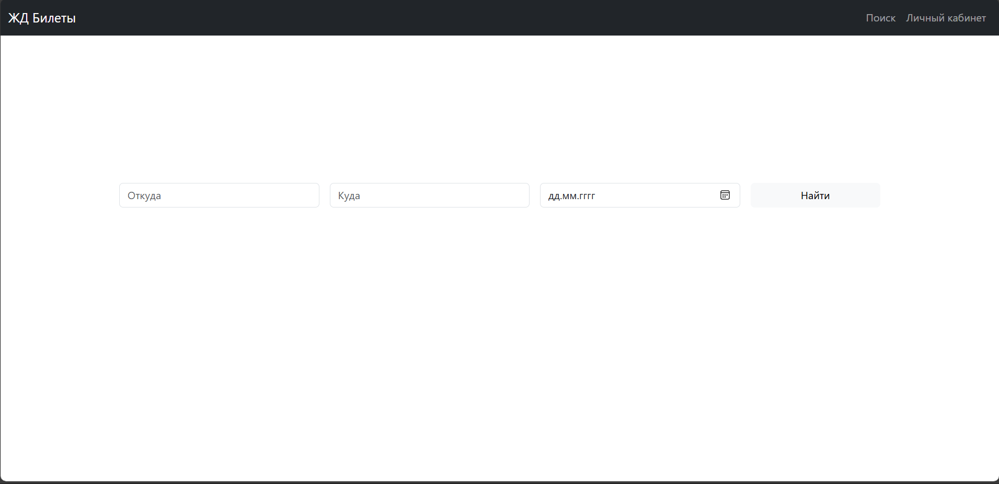
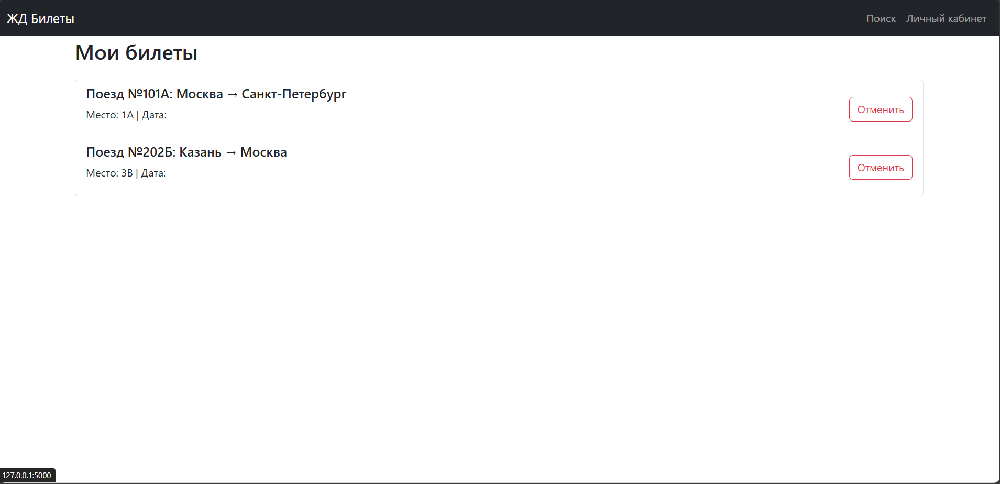
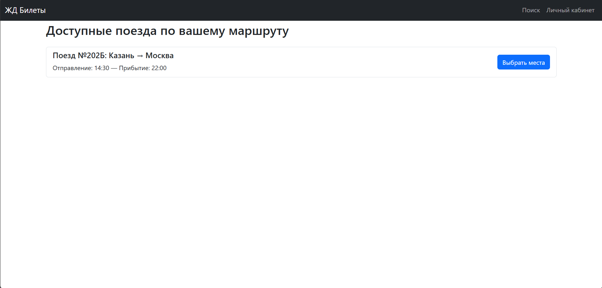
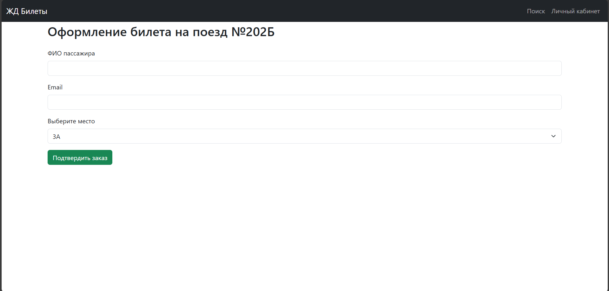

# Лабораторная работа №3
 По дисциплине «Графический интерфейс интеллектуальных систем»

## Тема: "Создание высокоуровневого макета сайта"

**Выполнил:**
Студент 3 курса, группы ИИ-23  
Бусень А.Д.

**Проверила:**
Ситковец Я.С.

## Задание

Задача: сайт представляет собой макет высокого уровня без
функциональной части. Реализовать возможность демонстрации работы
сайта, заполняя поля необходимой информацией и демонстрируя переходы
между страницами сайта.

7. Сайт бронирования номеров в отелях.
Основные страницы:
• Главная страница: Список доступных отелей с кратким описанием
(локация, цена, рейтинг).
• Детальная страница отеля: Описание номеров, услуги отеля, фото, отзывы
клиентов.
• Форма бронирования: Ввод данных гостя, выбор даты заселения и
количества ночей.
• Подтверждение бронирования: Информация о бронировании с
возможностью отмены. 

1. Главное меню с бронированием билетов

2. Личный кабинет

3. Подбор доступных билетов 

4. Оформление билета

