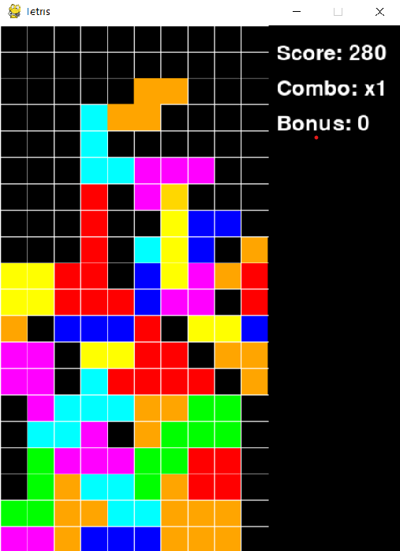
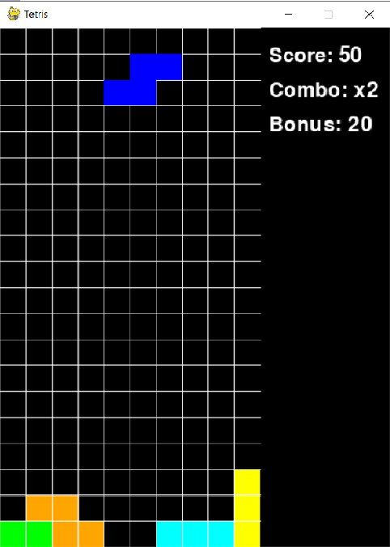

# Лабораторная работа №4
 По дисциплине «Графический интерфейс интеллектуальных систем»

## Тема: "Разработка игр"

**Выполнил:**
Студент 3 курса, группы ИИ-23  
Волкогон Н.И.

**Проверила:**
Ситковец Я.С.

## Задание

Задача: создать игровые проекты с сохранением канонического 
визуала и механик, дополнив их уникальными особенностями для 
расширения игрового опыта и стратегической глубины. 

Требования к проектам:   
Для каждой игры необходимо разработать:  
1. Канонический визуал и базовый игровой процесс.  
2. Две уникальные игровые особенности, которые:  
-Органично вписываются в оригинальную механику.  
-Добавляют стратегический или тактический элемент.  
-Повышают реиграбельность или сложность.  
	

Tetris   
Бонусные блоки с очисткой. Специальные блоки разрушают 
соседние ряды, помогая в сложных ситуациях.  
Мультипликатор комбо. Начисление бонусных очков за серию 
быстрых очисток.    

1. Игра

