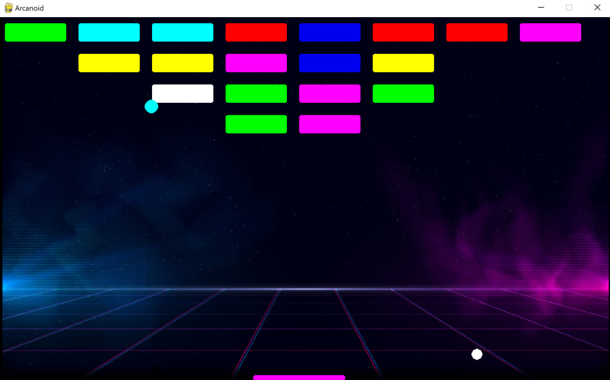
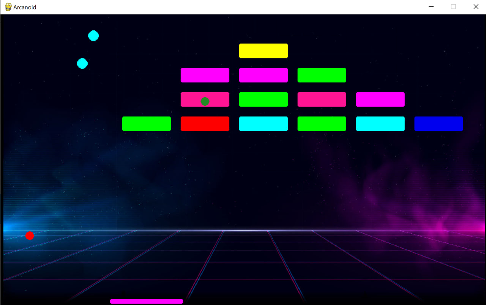
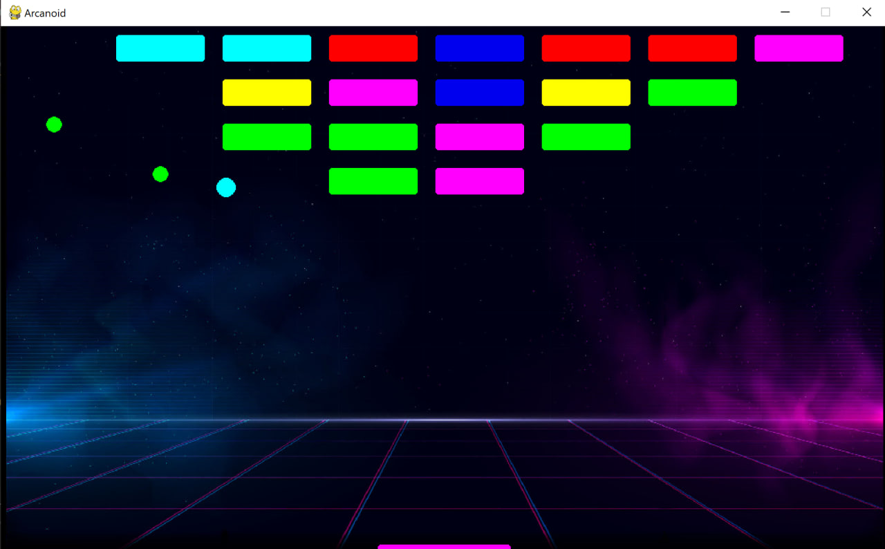

# Лабораторная работа 4

## Тема: "Разработка игр"

## Цель работы

Cоздать игровые проекты с сохранением канонического 
визуала и механик, дополнив их уникальными особенностями для 
расширения игрового опыта и стратегической глубины.

##Задача

3. Arkanoid  
   - Модификаторы ракетки. Бонусы изменяют размер, скорость или 
добавляют функцию «ловли» шарика.  
   - Многократные отскоки. Режим «мульти-шарика» для ускоренного 
разрушения блоков. 

## Требования

Для каждой игры необходимо разработать:  
1. Канонический визуал и базовый игровой процесс.  
2. Две уникальные игровые особенности, которые:  
   - Органично вписываются в оригинальную механику.  
   - Добавляют стратегический или тактический элемент.  
   - Повышают реиграбельность или сложность. 

## Код программы

```
import time
from constants import *
from Platform import Platform
from Ball import Ball
from block_patterns import patterns, choice
from Bonus import Bonus
from random import randint

pg.init()
pg.display.set_caption('Arcanoid')
img = pg.image.load('background.jpg')
img = pg.transform.scale(img, res)


def EndGameScenario(win: bool):
    black = pg.Rect(int(0.35 * screen_width), int(0.4 * screen_height), 500, 150)
    while True:
        for event in pg.event.get():
            if event.type == pg.QUIT:
                exit()
            if event.type == pg.KEYDOWN:
                if event.key == pg.K_ESCAPE:
                    exit()
                elif event.key == pg.K_r:
                    return True
        if win:
            screen.blit(text_youwin, (black.x + 50, black.y + 5))
        else:
            screen.blit(text_gameover, (black.x + 10, black.y + 5))
        screen.blit(text_reload, (black.x + 20, black.y + 100))
        pg.display.flip()


def ObjectCollision(obj1, obj2):
    if obj1.body.colliderect(obj2.body):
        delta_x = obj2.body.right - obj1.body.left if obj2.dx > 0 else obj1.body.right - obj2.body.left
        delta_y = obj2.body.bottom - obj1.body.top if obj2.dy > 0 else obj1.body.bottom - obj2.body.top
        if abs(delta_x - delta_y) < 5:
            obj2.dx *= -1
            obj2.dy *= -1
        elif delta_x > delta_y:
            obj2.dy *= -1
        elif delta_x < delta_y:
            obj2.dx *= -1
        return True
    return False


def DrawObjects(*args):
    for arg in args:
        if type(arg) != list:
            arg.draw()
        else:
            for obj in arg:
                obj.draw()
    pg.display.flip()


def AssignBonuses(pattern: list):
    size = len(pattern)
    n = int(0.2 * size)
    for i in range(n):
        b = choice(pattern)
        b.bonus = choice(bonuses)
    return pattern


def game(pattern: list):
    bonus_balls.clear()
    balls.clear()
    platform = Platform()
    ball = Ball(randint(10, screen_width // 2 - 100), screen_height)
    balls.append(ball)
    block_pattern = AssignBonuses(pattern.copy())
    clock = pg.time.Clock()
    time_end = time.time() + 1
    paused = False  # Переменная, которая отвечает за состояние паузы
    platform_speed = 0  # Скорость движения платформы

    while time.time() < time_end:  # Отображаем начальное состояние игры
        screen.blit(img, (0, 0))
        DrawObjects(platform, block_pattern)
        pg.display.flip()

    while True:
        for event in pg.event.get():
            if event.type == pg.QUIT:
                exit()
            if event.type == pg.KEYDOWN:
                if event.key == pg.K_SPACE:  # При нажатии на пробел включаем или выключаем паузу
                    paused = not paused
                if event.key == pg.K_ESCAPE:
                    exit()
                if event.key == pg.K_a:
                    platform_speed = -platform.speed  # Нажатие клавиши "а" устанавливает отрицательную скорость
                elif event.key == pg.K_d:
                    platform_speed = platform.speed  # Нажатие клавиши "d" устанавливает положительную скорость
            if event.type == pg.KEYUP:
                if event.key in [pg.K_a, pg.K_d]:
                    platform_speed = 0  # Отпускание клавиш сбрасывает скорость платформы на 0

        if not paused:  # Если игра не на паузе, обновляем состояние игры
            platform.body.x += platform_speed  # Изменяем позицию платформы на основе скорости
            if platform.body.left < 0:  # Проверяем, чтобы платформа не выходила за границы экрана
                platform.body.left = 0
            elif platform.body.right > screen_width:
                platform.body.right = screen_width

            screen.blit(img, (0, 0))
            for ball in balls:
                ball.fly()
                if ball.IsOut():
                    balls.remove(ball)
                    if len(balls) == 0:
                        restart = EndGameScenario(win=False)
                        if restart:
                            game(choice(patterns))
                if ObjectCollision(platform, ball) and ball.dy > 0:
                    platform.draw(col=pg.Color('white'))
                ball.WallBounce()

                for block in block_pattern:
                    if ObjectCollision(block, ball):
                        block.draw(col=pg.Color('white'))
                        block_pattern.remove(block)
                        if block.bonus:
                            bonus_balls.append(Bonus(block))

            if len(block_pattern) == 0:
                screen.blit(img, (0, 0))
                EndGameScenario(win=True)
                game(choice(patterns))

            for bb in bonus_balls:
                bb.drop()
                if bb.IsOut():
                    bonus_balls.remove(bb)
                if bb.body.colliderect(platform.body):
                    exec(bb.bonus)
                    bonus_balls.remove(bb)

        # Отображаем объекты на экране
        DrawObjects(platform, balls, block_pattern, bonus_balls)
        pg.display.flip()
        clock.tick(fps)


if __name__ == '__main__':
    game(choice(patterns))

```
 
## Результаты работы

Интерфейс
 
 
 

