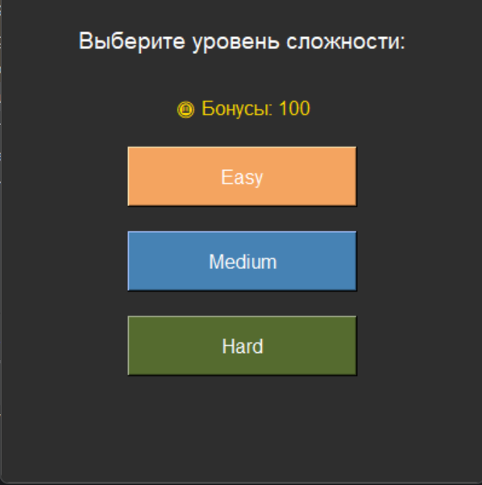
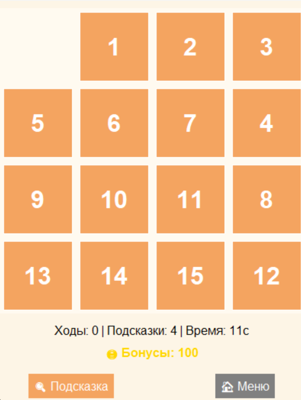
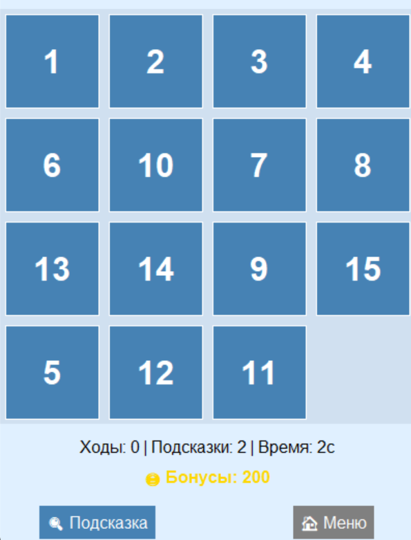
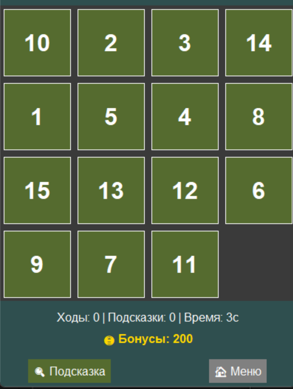
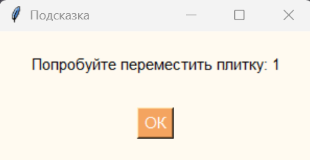

# Лабораторная работа 4-5

## Тема: "Разработка игр"

## Цель работы

 Создать игровые проекты с сохранением канонического визуала и механик, дополнив их уникальными особенностями для расширения игрового опыта и стратегической глубины.

## Основные требования

1. Канонический визуал и базовый игровой процесс.
2. Две уникальные игровые особенности, которые:
   - Органично вписываются в оригинальную механику.  
   - Добавляют стратегический или тактический элемент.
   - Повышают реиграбельность или сложность.
    

## Вариант 4 - Пятнашки (15 Puzzle)
### Реализованы следующие функции:
- Выбор сложности игры
- Подсказки
- Начисление и сохранение бонусных очков

## Код программы
### game.py:
```
import tkinter as tk
from tkinter import messagebox, Toplevel, Label, Button
import random
import time
import copy
import heapq
import json
import os
import secrets


BOARD_SIZE = 4
TILE_SIZE = 100
PADDING = 5
TIME_LIMIT = 180
BONUS_FILE = "bonus_score.json"

def load_bonus():
    if os.path.exists(BONUS_FILE):
        with open(BONUS_FILE, "r") as f:
            return json.load(f).get("bonus", 0)
    return 0

def save_bonus(score):
    with open(BONUS_FILE, "w") as f:
        json.dump({"bonus": score}, f)

class PuzzleGame:
    def __init__(self, master, difficulty='medium'):
        self.master = master
        self.master.title("Пятнашки")
        self.difficulty = difficulty
        self.set_theme()

        self.frame = tk.Frame(master, bg=self.bg_color)
        self.frame.pack()

        self.canvas = tk.Canvas(self.frame, width=BOARD_SIZE * TILE_SIZE, height=BOARD_SIZE * TILE_SIZE, bg=self.canvas_color, highlightthickness=0)
        self.canvas.grid(row=0, column=0, columnspan=3, pady=10)

        self.board = []
        self.empty = (3, 3)
        self.moves = 0
        self.running = True
        self.start_time = time.time()

        hints_by_difficulty = {'easy': 4, 'medium': 2, 'hard': 0}
        mix_by_difficulty = {'easy': 10, 'medium': 50, 'hard': 200}
        self.hints_left = hints_by_difficulty.get(self.difficulty, 0)
        self.mix_count = mix_by_difficulty.get(self.difficulty, 50)

        self.bonus = load_bonus()

        self.generate_board()
        self.draw_board()

        self.canvas.bind("<Button-1>", self.click)

        self.status = tk.Label(self.frame, text=f"Ходы: {self.moves} | Подсказки: {self.hints_left} | Время: 0с", bg=self.bg_color, fg=self.status_fg, font=("Arial", 12))
        self.status.grid(row=1, column=0, columnspan=3)

        self.bonus_label = tk.Label(self.frame, text=f"🪙 Бонусы: {self.bonus}", bg=self.bg_color, fg="gold", font=("Arial", 12, "bold"))
        self.bonus_label.grid(row=2, column=0, columnspan=3, pady=(5, 10))

        self.hint_button = tk.Button(self.frame, text="🔍 Подсказка", command=self.show_hint, bg=self.button_color, fg="white", font=("Arial", 12), relief=tk.FLAT)
        self.hint_button.grid(row=3, column=0, padx=10, pady=5)

        self.menu_button = tk.Button(self.frame, text="🏠 Меню", command=self.back_to_menu, bg="gray", fg="white", font=("Arial", 12), relief=tk.FLAT)
        self.menu_button.grid(row=3, column=2, padx=10, pady=5)

        self.update_timer()

    def set_theme(self):
        if self.difficulty == 'easy':
            self.bg_color = '#fdf5e6'
            self.canvas_color = '#fffaf0'
            self.button_color = '#f4a460'
            self.status_fg = 'black'
            self.dialog_bg = '#fffaf0'
        elif self.difficulty == 'medium':
            self.bg_color = '#e0f0ff'
            self.canvas_color = '#d0e0f0'
            self.button_color = '#4682b4'
            self.status_fg = 'black'
            self.dialog_bg = '#d0e0f0'
        else:
            self.bg_color = '#2f4f4f'
            self.canvas_color = '#3a3a3a'
            self.button_color = '#556b2f'
            self.status_fg = 'white'
            self.dialog_bg = '#3a3a3a'

    def back_to_menu(self):
        self.master.destroy()
        choose_difficulty()

    def generate_board(self):
        self.board = [[(i * BOARD_SIZE + j + 1) % 16 for j in range(BOARD_SIZE)] for i in range(BOARD_SIZE)]
        self.empty = (3, 3)
        for _ in range(self.mix_count):
            i, j = self.empty
            dirs = [(-1, 0), (1, 0), (0, -1), (0, 1)]
            dirs = sorted(dirs, key=lambda x: secrets.randbelow(1000))
            for dx, dy in dirs:
                ni, nj = i + dx, j + dy
                if 0 <= ni < BOARD_SIZE and 0 <= nj < BOARD_SIZE:
                    self.board[i][j], self.board[ni][nj] = self.board[ni][nj], self.board[i][j]
                    self.empty = (ni, nj)
                    break

    def draw_board(self):
        self.canvas.delete("all")
        for i in range(BOARD_SIZE):
            for j in range(BOARD_SIZE):
                num = self.board[i][j]
                if num != 0:
                    x0 = j * TILE_SIZE + PADDING
                    y0 = i * TILE_SIZE + PADDING
                    x1 = x0 + TILE_SIZE - 2 * PADDING
                    y1 = y0 + TILE_SIZE - 2 * PADDING
                    self.canvas.create_rectangle(x0, y0, x1, y1, fill=self.button_color, outline="white")
                    self.canvas.create_text((x0 + x1) // 2, (y0 + y1) // 2, text=str(num), font=("Arial", 24, "bold"), fill="white")

    def click(self, event):
        if not self.running:
            return
        col, row = event.x // TILE_SIZE, event.y // TILE_SIZE
        if abs(row - self.empty[0]) + abs(col - self.empty[1]) == 1:
            self.board[self.empty[0]][self.empty[1]], self.board[row][col] = self.board[row][col], 0
            self.empty = (row, col)
            self.moves += 1
            self.draw_board()
            self.update_status()
            if self.check_win():
                self.game_over()

    def update_status(self):
        elapsed = int(time.time() - self.start_time)
        self.status.config(text=f"Ходы: {self.moves} | Подсказки: {self.hints_left} | Время: {elapsed}с")

    def update_timer(self):
        if self.running:
            self.update_status()
            self.master.after(1000, self.update_timer)

    def check_win(self):
        target = list(range(1, 16)) + [0]
        current = sum(self.board, [])
        return current == target

    def game_over(self):
        self.running = False
        elapsed = int(time.time() - self.start_time)
        bonus = 100 if elapsed <= TIME_LIMIT else 0
        if bonus:
            self.bonus += bonus
            save_bonus(self.bonus)
            self.bonus_label.config(text=f"🪙 Бонусы: {self.bonus}")
        message = f"\u2728 Поздравляем! Вы собрали пазл за {self.moves} ходов и {elapsed} секунд.\n"
        if bonus:
            message += f"\ud83c\udf81 Бонус за быстрое решение: {bonus} очков!"
        else:
            message += f"\u231b Попробуйте решить быстрее в следующий раз!"
        self.custom_message("Победа!", message)

    def show_hint(self):
        if not self.running:
            return
        if self.hints_left == 0:
            self.custom_message("Подсказки", "Подсказки закончились.")
            return
        move = self.get_next_best_move()
        if move:
            i, j = move
            tile = self.board[i][j]
            self.custom_message("Подсказка", f"Попробуйте переместить плитку: {tile}")
            self.hints_left -= 1
            self.update_status()
        else:
            self.custom_message("Подсказка", "Подсказка недоступна.")

    def get_next_best_move(self):
        start = sum(self.board, [])
        goal = list(range(1, 16)) + [0]

        def heuristic(state):
            return sum(abs((val - 1) // 4 - idx // 4) + abs((val - 1) % 4 - idx % 4)
                       for idx, val in enumerate(state) if val != 0)

        def neighbors(state):
            idx = state.index(0)
            x, y = divmod(idx, 4)
            dirs = [(-1, 0), (1, 0), (0, -1), (0, 1)]
            for dx, dy in dirs:
                nx, ny = x + dx, y + dy
                if 0 <= nx < 4 and 0 <= ny < 4:
                    nidx = nx * 4 + ny
                    new_state = state[:]
                    new_state[idx], new_state[nidx] = new_state[nidx], new_state[idx]
                    yield new_state, (nx, ny)

        visited = set()
        heap = [(heuristic(start), 0, start, [])]
        while heap:
            est, cost, state, path = heapq.heappop(heap)
            state_t = tuple(state)
            if state == goal:
                if path:
                    return path[0]
                return None
            if state_t in visited:
                continue
            visited.add(state_t)
            for new_state, move in neighbors(state):
                heapq.heappush(heap, (cost + 1 + heuristic(new_state), cost + 1, new_state, path + [move]))
        return None

    def custom_message(self, title, message):
        win = Toplevel(self.master)
        win.title(title)
        win.configure(bg=self.dialog_bg)
        win.geometry("300x150")
        Label(win, text=message, bg=self.dialog_bg, fg="black" if self.difficulty != "hard" else "white", font=("Arial", 11), wraplength=280).pack(pady=20)
        Button(win, text="ОК", command=win.destroy, bg=self.button_color, fg="white", font=("Arial", 11)).pack(pady=10)


def start_game(difficulty):
    root = tk.Tk()
    PuzzleGame(root, difficulty)
    root.mainloop()

def choose_difficulty():
    diff_win = tk.Tk()
    diff_win.title("Выбор сложности")
    diff_win.geometry("400x400")
    diff_win.configure(bg="#2e2e2e")

    tk.Label(diff_win, text="Выберите уровень сложности:", font=("Arial", 14), bg="#2e2e2e", fg="white").pack(pady=20)

    bonus = load_bonus()
    tk.Label(diff_win, text=f"🪙 Бонусы: {bonus}", font=("Arial", 12), bg="#2e2e2e", fg="gold").pack(pady=10)

    for level, color in zip(['easy', 'medium', 'hard'], ['#f4a460', '#4682b4', '#556b2f']):
        tk.Button(diff_win, text=level.capitalize(), width=20, height=2, font=("Arial", 12), bg=color, fg="white",
                  command=lambda l=level: (diff_win.destroy(), start_game(l))).pack(pady=10)

    diff_win.mainloop()

if __name__ == "__main__":
    choose_difficulty()

```
## Результаты работы

### Интерфейс
1. Выбор сложности:

2. Уровни:



3. Подсказка:

4. Победа:
