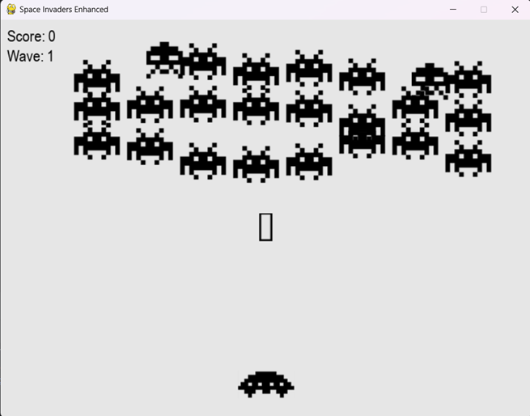
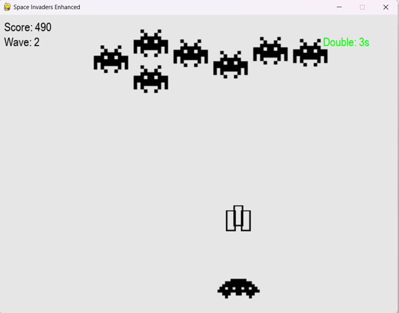

# Лабораторная работа №4
 По дисциплине «Графический интерфейс интеллектуальных систем»

## Тема: "Разработка игр"

**Выполнил:**
Студент 3 курса, группы ИИ-23  
Глухарев Д.Е.

**Проверила:**
Ситковец Я.С.

## Задание

Цель работы: создать игровые проекты с сохранением канонического
визуала и механик, дополнив их уникальными особенностями для
расширения игрового опыта и стратегической глубины.

Требования к проектам:
Для каждой игры необходимо разработать:
1. Канонический визуал и базовый игровой процесс.
2. Две уникальные игровые особенности, которые:
- Органично вписываются в оригинальную механику.
- Добавляют стратегический или тактический элемент.
- Повышают реиграбельность или сложность.

Вариант 5. Space Invaders.
- Улучшение оружия. Временные бонусы (двойной выстрел, щит).
- Специальные волны врагов. Противники с измененной тактикой за
бонусные очки.

1. Графический интерфейс игры

2. Использование бонуса на улучшенные выстрелы

