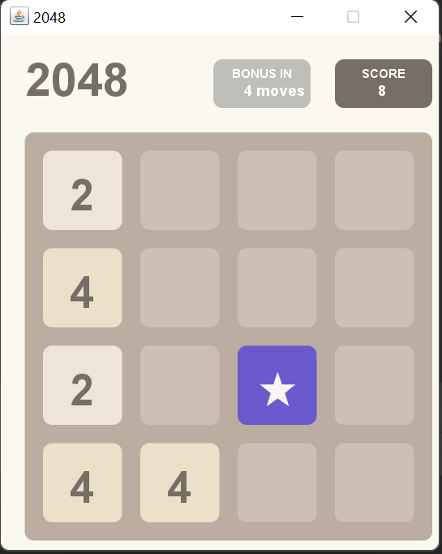

# Лабораторная работа 4-5

## Тема: "Разработка игр"

**Выполнил:**
Студент 3 курса, группы ИИ-23  
Скварнюк Д.Н.

**Проверила:**
Ситковец Я.С.

10 вариант

## Цель работы

  Создать игровые проекты с сохранением канонического визуала и механик, дополнив их уникальными особенностями для расширения игрового опыта и стратегической глубины.

## Задача

Игра 2048

## Требования к проектам:

Для каждой игры необходимо разработать:
1. Канонический визуал и базовый игровой процесс.
2. Две уникальные игровые особенности, которые:
- Органично вписываются в оригинальную механику.
- Добавляют стратегический или тактический элемент.
- Повышают реиграбельность или сложность.
 
## Уникальные особенности

1. Плитка перемешивания выступает в роли усложнения (может всё заруинить).
2. Плитка слияния может быть мегаимбой, если слить её с плиткой 1024 (но это практически не возможно).
3. Плитка удаления - это ваше спасения после перемешивание (её не обязательно использовать сразу, ЭТО НЕ БАГ А ФИЧА)
4. В игре есть 2 чита, но их надо найти самому

P.S. Егор Владимирович советовать как уникальность поворот квадратного поля (где вообще не важно плитки сверху, снизу или слева) это гениально. Тактическое изменение расположения плиток - класно, но ещё большая имба чем слияние

## Результаты работы

### Игровое поле
 
### Уникальные плитки
#### Плитка слияние (универсально соединяется с любой плиткой)
 
#### Плитка удаления (даёт возможность удалить любую плитку на выбор)
 
#### Плиткак перемешивания (перемешивает все плитки на поле)
 
### Игра проходима (вот пруфы)
 
