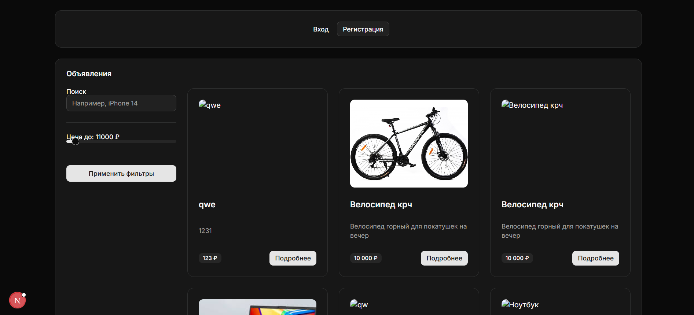
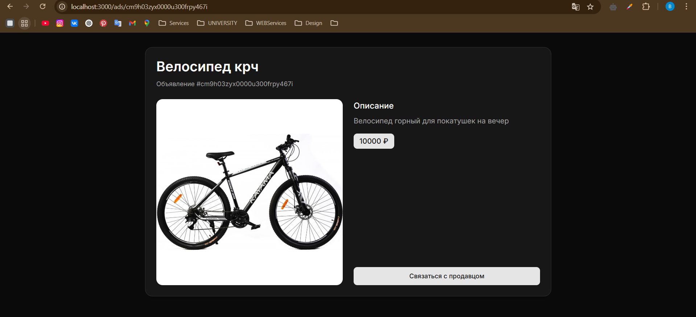
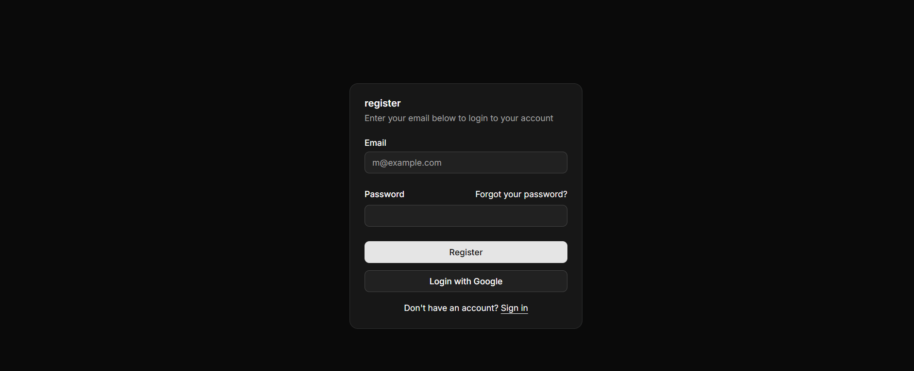
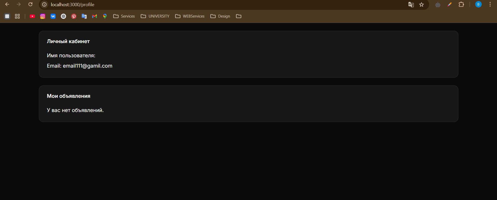
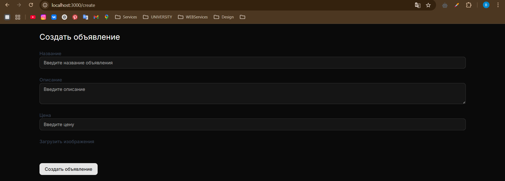

## Тема: "Создание высокоуровневого макета сайта"

**Выполнил:**
Студент 3 курса, группы ИИ-23  
Швороб В.А.

**Проверила:**
Ситковец Я.С.

12 вариант

## Цель работы

сайт представляет собой макет высокого уровня без функциональной части. Реализовать возможность демонстрации работы сайта,заполняя поля необходимой информацией и демонстрируя переходы между страницами сайта

## Основные требования

#### Сайт барахолки.

Основные страницы:

- Главная страница: Список объявлений с основными параметрами
  (категория, цена).
- Страница объявления: Полное описание товара с возможностью
  добавления в избранное.
- Создание объявления: Форма для ввода данных (заголовок, описание,
  цена, изображения).
- Личный кабинет: Управление созданными объявлениями и просмотр
  статистики.

## Результаты работы

##### На чем написан проект

- Next.js, TypeScript;
- Shadcn/ui, Tailwind;
- Next.js Sever, GraphQL, PostgreSQL, Prisma.

Установка необходимых пакетов:

```bash
bun install
```

Запуск проекта:

```shell
bun run dev
```

### Интерфейс

Стартовай экран:


Пример страницы объявления:


Регистрация:


Профиль:


Создание объявления:

