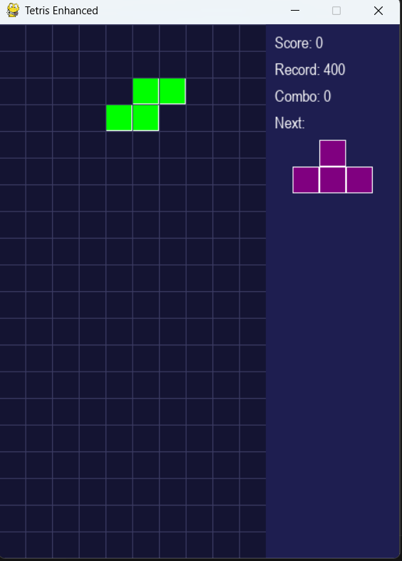
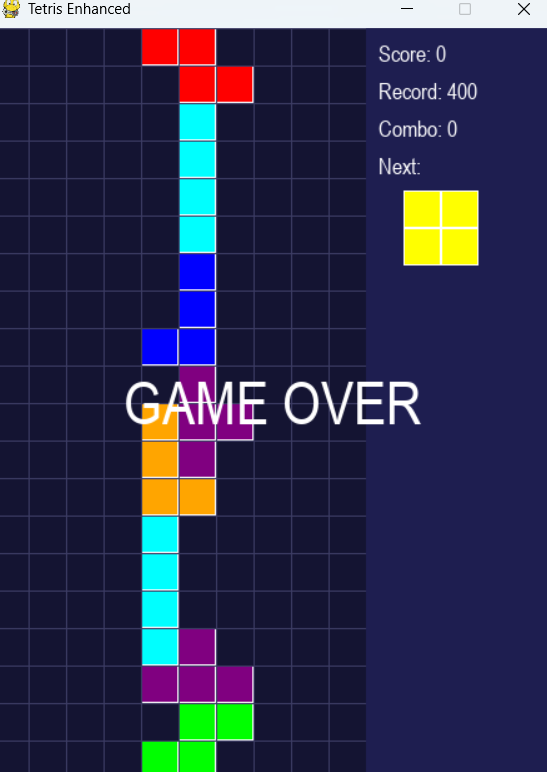

# Лабораторная работа 4

## Тема: "Разработка игр"

**Выполнил:**
Студент 3 курса, группы ИИ-23  
Волкогон Н.И.

**Проверила:**
Ситковец Я.С.

## Цель работы

Cоздать игровые проекты с сохранением канонического
визуала и механик, дополнив их уникальными особенностями для
расширения игрового опыта и стратегической глубины.

## Задача

2. Tetris

- Бонусные блоки с очисткой. Специальные блоки разрушают
  соседние ряды, помогая в сложных ситуациях.
- Мультипликатор комбо. Начисление бонусных очков за серию
  быстрых очисток.

## Требования

Для каждой игры необходимо разработать:

1. Канонический визуал и базовый игровой процесс.
2. Две уникальные игровые особенности, которые:
   - Органично вписываются в оригинальную механику.
   - Добавляют стратегический или тактический элемент.
   - Повышают реиграбельность или сложность.

## Код программы

```
import pygame
import random
import os
import math

# Constants
GRID_WIDTH = 10
GRID_HEIGHT = 20
CELL_SIZE = 30
SIDEBAR_WIDTH = 150
SCREEN_WIDTH = GRID_WIDTH * CELL_SIZE + SIDEBAR_WIDTH
SCREEN_HEIGHT = GRID_HEIGHT * CELL_SIZE
LINE_CLEAR_DELAY = 200  # milliseconds
RECORD_FILE = 'record.txt'

# Colors
COLORS = [
    (0, 0, 0),      # 0 empty
    (0, 255, 255),  # I
    (0, 0, 255),    # J
    (255, 165, 0),  # L
    (255, 255, 0),  # O
    (0, 255, 0),    # S
    (128, 0, 128),  # T
    (255, 0, 0),    # Z
    (255, 215, 0)   # bonus block (gold)
]
LINE_COLOR = (60, 60, 100)
BG_COLOR = (20, 20, 50)
SIDEBAR_BG = (30, 30, 80)
BORDER_COLOR = (255, 255, 255)
TEXT_COLOR = (255, 255, 255)

# Tetromino shapes
SHAPES = [
    [[1,1,1,1]],
    [[2,0,0],[2,2,2]],
    [[0,0,3],[3,3,3]],
    [[4,4],[4,4]],
    [[0,5,5],[5,5,0]],
    [[0,6,0],[6,6,6]],
    [[7,7,0],[0,7,7]]
]
BONUS_SHAPE = [[8]]

class Tetromino:
    def __init__(self, shape, x, y):
        self.shape = shape
        self.x = x
        self.y = y
        self.rotation = 0

    def image(self): return self.shape[self.rotation]
    def rotate(self): self.rotation = (self.rotation + 1) % len(self.shape)

# Generate rotations
def create_rotations(base_shapes):
    rotations = []
    for shape in base_shapes:
        rots, mat = [], shape
        for _ in range(4):
            rots.append(mat)
            mat = [list(row) for row in zip(*mat[::-1])]
        unique = []
        for r in rots:
            if r not in unique: unique.append(r)
        rotations.append(unique)
    return rotations

SHAPES_ROT = create_rotations(SHAPES)
BONUS_ROT = create_rotations([BONUS_SHAPE])[0]

class Tetris:
    def __init__(self):
        self.grid = [[0] * GRID_WIDTH for _ in range(GRID_HEIGHT)]
        self.score = 0
        self.combo = 0
        self.game_over = False
        self.current = self.get_new_piece()
        self.next_piece = self.get_new_piece()
        self.record = self.load_record()
        self.screen = None

    def load_record(self):
        if os.path.exists(RECORD_FILE):
            try: return int(open(RECORD_FILE).read())
            except: return 0
        return 0

    def save_record(self):
        if self.score > self.record:
            open(RECORD_FILE, 'w').write(str(self.score))

    def get_new_piece(self):
        if random.random() < 0.05:
            return Tetromino(BONUS_ROT, GRID_WIDTH // 2, 0)
        shape = random.choice(SHAPES_ROT)
        return Tetromino(shape, GRID_WIDTH // 2 - len(shape[0]) // 2, 0)

    def intersects(self):
        for i, row in enumerate(self.current.image()):
            for j, val in enumerate(row):
                if val:
                    x, y = self.current.x + j, self.current.y + i
                    if x < 0 or x >= GRID_WIDTH or y >= GRID_HEIGHT or self.grid[y][x] != 0:
                        return True
        return False

    def freeze(self):
        for i, row in enumerate(self.current.image()):
            for j, val in enumerate(row):
                if val: self.grid[self.current.y + i][self.current.x + j] = val
        cnt, rows = self.get_clearing_rows()
        if cnt:
            self.flash_rows(rows)
            self.combo += 1
            self.score += (100 * cnt) * self.combo
            self.clear_lines(rows)
        else:
            self.combo = 0
        if self.current.shape == BONUS_ROT:
            self.trigger_bonus(self.current.x, self.current.y)
        self.current, self.next_piece = self.next_piece, self.get_new_piece()
        if self.intersects():
            self.game_over = True
            self.save_record()

    def get_clearing_rows(self):
        rows = [i for i, r in enumerate(self.grid) if all(r)]
        return len(rows), rows

    def flash_rows(self, rows):
        temp = [self.grid[r][:] for r in rows]
        start = pygame.time.get_ticks()
        while pygame.time.get_ticks() - start < LINE_CLEAR_DELAY:
            for r in rows: self.grid[r] = [0] * GRID_WIDTH
            draw_frame(self); pygame.display.flip()
        for idx, r in enumerate(rows): self.grid[r] = temp[idx]

    def clear_lines(self, rows):
        for r in sorted(rows):
            del self.grid[r]
            self.grid.insert(0, [0] * GRID_WIDTH)

    def trigger_bonus(self, x, y):
        for r in [y - 1, y, y + 1]:
            if 0 <= r < GRID_HEIGHT:
                for c in range(GRID_WIDTH): self.grid[r][c] = 0

    def move(self, dx):
        old = self.current.x; self.current.x += dx
        if self.intersects(): self.current.x = old

    def drop(self):
        self.current.y += 1
        if self.intersects():
            self.current.y -= 1
            self.freeze()

    def rotate(self):
        old = self.current.rotation; self.current.rotate()
        if self.intersects(): self.current.rotation = old

# Drawing
def draw_matrix(scr, matrix, offset, tick=0):
    ox, oy = offset
    for i, row in enumerate(matrix):
        for j, val in enumerate(row):
            if val:
                rect = pygame.Rect(ox + j * CELL_SIZE, oy + i * CELL_SIZE, CELL_SIZE, CELL_SIZE)
                pygame.draw.rect(scr, COLORS[val], rect)
                pygame.draw.rect(scr, BORDER_COLOR, rect, 1)
                if val == 8:
                    w = 2 + int(2 * math.sin(tick / 200))
                    pygame.draw.rect(scr, (255, 0, 0), rect, w)


def draw_grid(scr):
    for x in range(GRID_WIDTH + 1): pygame.draw.line(scr, LINE_COLOR, (x * CELL_SIZE, 0), (x * CELL_SIZE, SCREEN_HEIGHT))
    for y in range(GRID_HEIGHT + 1): pygame.draw.line(scr, LINE_COLOR, (0, y * CELL_SIZE), (GRID_WIDTH * CELL_SIZE, y * CELL_SIZE))


def draw_sidebar(scr, game):
    rect = pygame.Rect(GRID_WIDTH * CELL_SIZE, 0, SIDEBAR_WIDTH, SCREEN_HEIGHT)
    pygame.draw.rect(scr, SIDEBAR_BG, rect)
    font = pygame.font.SysFont('Arial', 18)
    labels = [
        f"Score: {game.score}",
        f"Record: {game.record}",
        f"Combo: {game.combo}",
        "Next:"
    ]
    y = 10
    for text in labels:
        scr.blit(font.render(text, True, TEXT_COLOR), (GRID_WIDTH * CELL_SIZE + 10, y))
        y += 30
    draw_matrix(scr, game.next_piece.image(), (GRID_WIDTH * CELL_SIZE + 30, y), pygame.time.get_ticks())


def draw_frame(game):
    scr, tick = game.screen, pygame.time.get_ticks()
    scr.fill(BG_COLOR)
    draw_matrix(scr, game.grid, (0, 0), tick)
    draw_matrix(scr, game.current.image(), (game.current.x * CELL_SIZE, game.current.y * CELL_SIZE), tick)
    draw_grid(scr)
    draw_sidebar(scr, game)

# Main game loop
def main():
    pygame.init()
    clk = pygame.time.Clock()
    game = Tetris()
    game.screen = pygame.display.set_mode((SCREEN_WIDTH, SCREEN_HEIGHT))
    pygame.display.set_caption("Tetris Enhanced")
    fall_event = pygame.USEREVENT + 1
    pygame.time.set_timer(fall_event, 500)

    while not game.game_over:
        for event in pygame.event.get():
            if event.type == pygame.QUIT:
                game.game_over = True
                game.save_record()
            elif event.type == fall_event:
                game.drop()
            elif event.type == pygame.KEYDOWN:
                if event.key == pygame.K_LEFT: game.move(-1)
                elif event.key == pygame.K_RIGHT: game.move(1)
                elif event.key == pygame.K_DOWN: game.drop()
                elif event.key == pygame.K_UP: game.rotate()
        draw_frame(game)
        pygame.display.flip()
        clk.tick(60)

    # Game Over display
    font = pygame.font.SysFont('Arial', 48)
    text_surf = font.render('GAME OVER', True, TEXT_COLOR)
    text_rect = text_surf.get_rect(center=(SCREEN_WIDTH / 2, SCREEN_HEIGHT / 2))
    game.screen.blit(text_surf, text_rect)
    pygame.display.flip()
    pygame.time.delay(3000)
    pygame.quit()

if __name__ == '__main__':
    main()

```

## Результаты работы

Интерфейс




