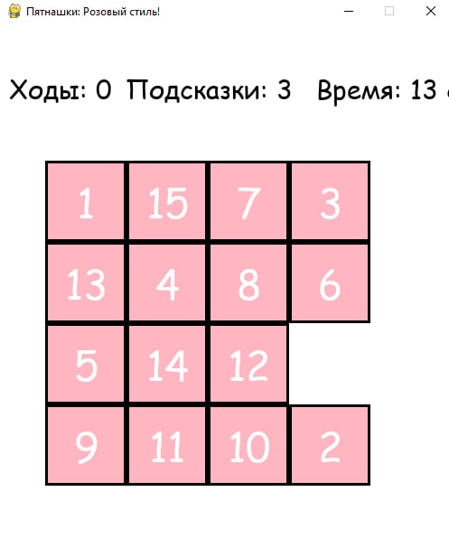

# Лабораторная работа 4-5

## Тема: "Разработка игр"

**Выполнила:**
Студентка 3 курса, группы ИИ-23  
Маслакова К.Ю.

**Проверила:**
Ситковец Я.С.

4 вариант

## Цель работы

  Создать игровые проекты с сохранением канонического визуала и механик, дополнив их уникальными особенностями для расширения игрового опыта и стратегической глубины.

## Задача

Пятнашки

## Требования к проектам:

Для каждой игры необходимо разработать:
1. Канонический визуал и базовый игровой процесс.
2. Две уникальные игровые особенности, которые:
- Органично вписываются в оригинальную механику.
- Добавляют стратегический или тактический элемент.
- Повышают реиграбельность или сложность.

Особенности:
 - Система подсказок. Ограниченные подсказки для оптимальных
ходов.
 - Режим ускоренного решения. Бонусные очки за сборку пазла за
установленное время. 

## Результаты работы

 