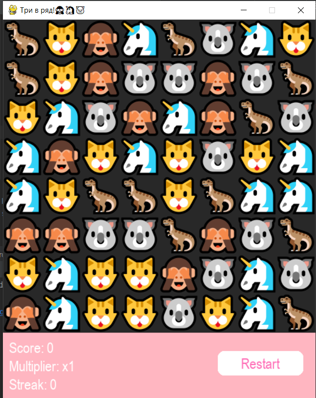
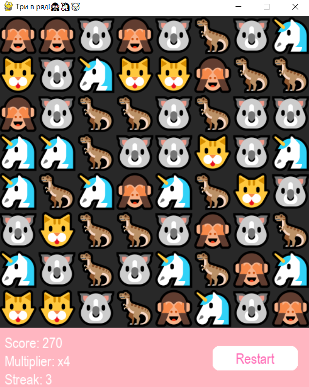
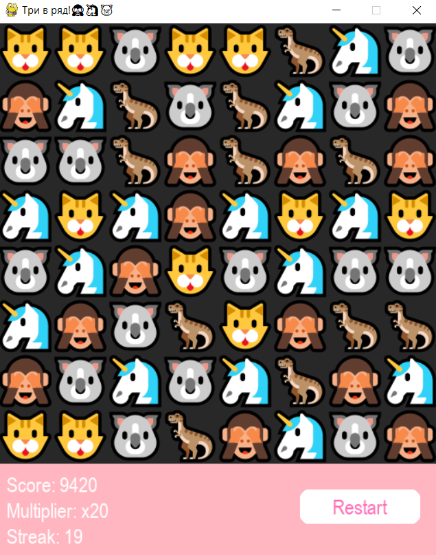
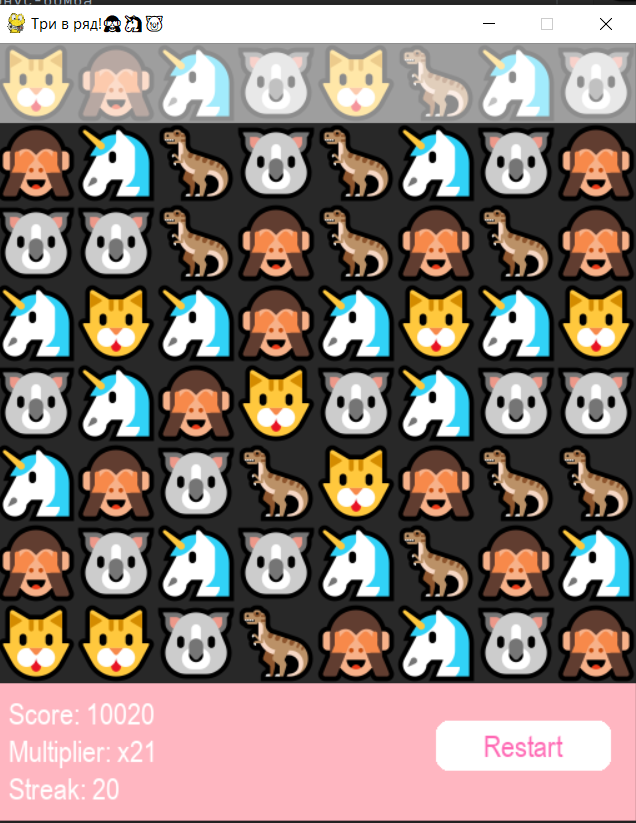
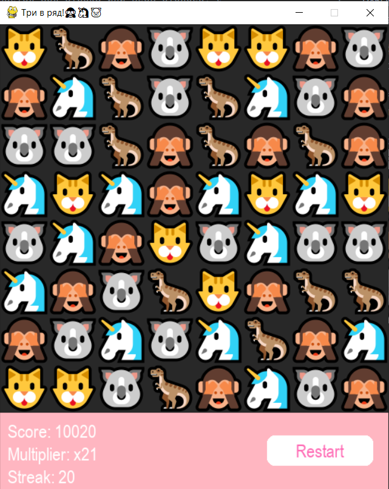

# Лабораторная работа 4

## Тема: "Лабораторная работа №4-5. Разработка игр"

## Цель работы:
создать игровые проекты с сохранением канонического
визуала и механик, дополнив их уникальными особенностями для
расширения игрового опыта и стратегической глубины. 

## Задача
Вариант 8
 - Специальные гемы. Массовая очистка рядов или столбцов.
 - Комбо-механика. Мультипликатор очков за последовательные
удачные ходы. 
8. Три в ряд


## Требования

Примерные шаги разработки:
1. Анализ оригинальной игры:
 - Изучение механик, визуального стиля, слабых мест.
2. Проектирование особенностей:
 - Выбор 2 уникальных механик, дополняющих геймплей.
3. Прототипирование:
 - Создание базовой версии игры с каноническим визуалом.
4. Интеграция особенностей:
 - Тестирование баланса и взаимодействия новых элементов.
5. Пользовательское тестирование:
 - Сбор обратной связи, корректировка сложности.
6. Финальная доработка:
 - Оптимизация кода, улучшение графики, добавление анимаций.
P.S. игровые особенности приведены в качестве примера с целью
демонстрации примерных ожиданий от итоговой реализации конечной
работы.

## Код программы

```
import pygame
import random
import sys

pygame.init()
pygame.display.set_caption("Три в ряд!🙈🦄🐨")

GRID_SIZE = 8
GEM_SIZE = 64
PADDING = 4

SCREEN_SIZE = GRID_SIZE * GEM_SIZE
screen = pygame.display.set_mode((SCREEN_SIZE, SCREEN_SIZE + 110))  # extra HUD space

FONT = pygame.font.SysFont("arial", 24)

GEM_SYMBOLS = ["🙈", "🦄", "🦖", "🐱", "🐨"]


ROW_SPECIAL_COLOUR = (250, 250, 250)
COL_SPECIAL_COLOUR = (0, 255, 255)

FPS = 60
clock = pygame.time.Clock()


class Gem:
    def __init__(self, symbol, special=None):
        self.symbol = symbol
        self.special = special

    def draw(self, surf, x, y, selected=False):
        outer = pygame.Rect(x, y, GEM_SIZE, GEM_SIZE)
        pygame.draw.rect(surf, (40, 40, 40), outer)

        if selected:
            pygame.draw.rect(surf, (255, 215, 0), outer, 4)

        symbol_font = pygame.font.SysFont("segoeuiemoji", GEM_SIZE - 10)
        symbol_surface = symbol_font.render(self.symbol, True, (255, 255, 255))
        symbol_rect = symbol_surface.get_rect(center=outer.center)
        surf.blit(symbol_surface, symbol_rect)

        if self.special:
            if self.special == 'row':
                pygame.draw.line(surf, (255, 255, 0), (outer.left + 5, outer.centery), (outer.right - 5, outer.centery), 3)
            else:
                pygame.draw.line(surf, (255, 255, 0), (outer.centerx, outer.top + 5), (outer.centerx, outer.bottom - 5), 3)


class Board:
    def __init__(self):
        self.score = 0
        self.multiplier = 1
        self.grid = []
        self._shuffle_until_playable()

    def random_gem(self):
        return Gem(random.choice(GEM_SYMBOLS))

    def in_bounds(self, x, y):
        return 0 <= x < GRID_SIZE and 0 <= y < GRID_SIZE

    def _generate_random_grid(self):
        self.grid = [[self.random_gem() for _ in range(GRID_SIZE)] for _ in range(GRID_SIZE)]

    def _shuffle_until_playable(self):
        for _ in range(1000):
            self._generate_random_grid()
            if not self.any_matches() and self.has_possible_move():
                return
        self._generate_random_grid()

    def swap(self, p1, p2):
        (x1, y1), (x2, y2) = p1, p2
        self.grid[y1][x1], self.grid[y2][x2] = self.grid[y2][x2], self.grid[y1][x1]

    def adjacent(self, p1, p2):
        (x1, y1), (x2, y2) = p1, p2
        return abs(x1 - x2) + abs(y1 - y2) == 1

    def find_matches(self):
        matches = []
        # horizontals
        for y in range(GRID_SIZE):
            run = [(0, y)]
            for x in range(1, GRID_SIZE):
                if self.grid[y][x].symbol == self.grid[y][x - 1].symbol:
                    run.append((x, y))
                else:
                    if len(run) >= 3:
                        matches.append(run)
                    run = [(x, y)]
            if len(run) >= 3:
                matches.append(run)

        for x in range(GRID_SIZE):
            run = [(x, 0)]
            for y in range(1, GRID_SIZE):
                if self.grid[y][x].symbol == self.grid[y - 1][x].symbol:
                    run.append((x, y))
                else:
                    if len(run) >= 3:
                        matches.append(run)
                    run = [(x, y)]
            if len(run) >= 3:
                matches.append(run)
        return matches

    def any_matches(self):
        return bool(self.find_matches())

    def has_possible_move(self):
        for y in range(GRID_SIZE):
            for x in range(GRID_SIZE):
                for dx, dy in ((1, 0), (0, 1)):
                    nx, ny = x + dx, y + dy
                    if not self.in_bounds(nx, ny):
                        continue
                    self.swap((x, y), (nx, ny))
                    found = self.find_matches()
                    self.swap((x, y), (nx, ny))
                    if found:
                        return True
        return False

    def apply_specials(self, matches):
        extra = set()
        for run in matches:
            for x, y in run:
                gem = self.grid[y][x]
                if gem.special == 'row':
                    for cx in range(GRID_SIZE):
                        extra.add((cx, y))
                elif gem.special == 'col':
                    for cy in range(GRID_SIZE):
                        extra.add((x, cy))
        for pos in extra:
            if pos not in [p for run in matches for p in run]:
                matches.append([pos])
        return matches

    def promote_specials(self, matches):
        for run in matches:
            if len(run) >= 4:
                x, y = random.choice(run)
                orientation = 'row' if all(y == yy for _, yy in run) else 'col'
                gem = self.grid[y][x]
                gem.special = orientation
                gem.colour = ROW_SPECIAL_COLOUR if orientation == 'row' else COL_SPECIAL_COLOUR

    def remove_matches(self, matches):
        removed = 0
        for run in matches:
            for x, y in run:
                self.grid[y][x] = None
                removed += 1
        return removed

    def drop_gems(self):
        for x in range(GRID_SIZE):
            empty = []
            for y in reversed(range(GRID_SIZE)):
                if self.grid[y][x] is None:
                    empty.append(y)
                elif empty:
                    dest = empty.pop(0)
                    self.grid[dest][x], self.grid[y][x] = self.grid[y][x], None
                    empty.append(y)
            for y in empty:
                self.grid[y][x] = self.random_gem()

    def resolve_board(self, startup=False):
        removed_any = False
        while True:
            matches = self.find_matches()
            if not matches:
                break
            removed_any = True
            matches = self.apply_specials(matches)
            self.promote_specials(matches)

            removed = self.remove_matches(matches)
            if not startup:
                self.score += removed * 10 * self.multiplier

            self.drop_gems()

        if not self.has_possible_move():
            self._shuffle_until_playable()
        return removed_any

    def positions_row(self, row):
        return [(x, row) for x in range(GRID_SIZE)]

    def positions_col(self, col):
        return [(col, y) for y in range(GRID_SIZE)]

    def remove_positions(self, positions):
        for x, y in positions:
            self.grid[y][x] = None


def main():
    board = Board()
    running = True

    selected = None
    combo_streak = 0

    bomb_active = False
    bomb_timer = 0
    bomb_positions = []

    restart_rect = pygame.Rect(SCREEN_SIZE - 160, SCREEN_SIZE + 30, 140, 40)

    while running:
        clock.tick(FPS)

        for event in pygame.event.get():
            if event.type == pygame.QUIT:
                running = False

            elif event.type == pygame.MOUSEBUTTONDOWN and event.button == 1:
                mx, my = event.pos

                # Кнопка "Restart"
                if restart_rect.collidepoint(event.pos):
                    board = Board()
                    selected = None
                    combo_streak = 0
                    bomb_active = False
                    bomb_timer = 0
                    bomb_positions = []
                    continue

                if bomb_active or my > SCREEN_SIZE:
                    continue

                x, y = mx // GEM_SIZE, my // GEM_SIZE

                if selected is None:
                    selected = (x, y)
                    continue

                if board.adjacent(selected, (x, y)):
                    board.swap(selected, (x, y))
                    initial_matches = board.find_matches()
                    success = bool(initial_matches)

                    if success:
                        board.resolve_board()
                        board.multiplier += 1
                        combo_streak += 1

                        if combo_streak % 10 == 0:
                            sx, sy = selected
                            tx, ty = x, y
                            target_run = next((run for run in initial_matches
                                               if (sx, sy) in run or (tx, ty) in run),
                                              initial_matches[0])
                            if all(yy == target_run[0][1] for _, yy in target_run):
                                index = target_run[0][1]
                                bomb_positions = board.positions_row(index)
                            else:
                                index = target_run[0][0]
                                bomb_positions = board.positions_col(index)

                            bomb_active = True
                            bomb_timer = 20
                    else:
                        board.swap(selected, (x, y))
                        board.multiplier = 1
                        combo_streak = 0

                    selected = None

        if bomb_active:
            bomb_timer -= 1
            if bomb_timer <= 0:
                board.remove_positions(bomb_positions)
                board.drop_gems()
                board.resolve_board()
                bomb_active = False
                bomb_positions.clear()

   
        screen.fill((255, 182, 193))  # розовый фон

        for y in range(GRID_SIZE):
            for x in range(GRID_SIZE):
                gem = board.grid[y][x]
                if gem:
                    gem.draw(screen, x * GEM_SIZE, y * GEM_SIZE, selected == (x, y))

        if bomb_active and (bomb_timer // 3) % 2 == 0:
            overlay = pygame.Surface((GEM_SIZE, GEM_SIZE), pygame.SRCALPHA)
            overlay.fill((255, 255, 255, 140))
            for x, y in bomb_positions:
                screen.blit(overlay, (x * GEM_SIZE, y * GEM_SIZE))

      
        hud_score = FONT.render(f"Score: {board.score}", True, (255, 255, 255))
        hud_mult = FONT.render(f"Multiplier: x{board.multiplier}", True, (255, 255, 255))
        hud_combo = FONT.render(f"Streak: {combo_streak}", True, (255, 255, 255))

        screen.blit(hud_score, (10, SCREEN_SIZE + 10))
        screen.blit(hud_mult, (10, SCREEN_SIZE + 40))
        screen.blit(hud_combo, (10, SCREEN_SIZE + 70))


        pygame.draw.rect(screen, (255, 255, 255), restart_rect, border_radius=10)
        label = FONT.render("Restart", True, (255, 105, 180))
        label_rect = label.get_rect(center=restart_rect.center)
        screen.blit(label, label_rect)

        pygame.display.flip()

    pygame.quit()
    sys.exit()


if __name__ == "__main__":
    main()

```
 
## Результаты работы
1. Начальный экран игры

Помимо самого игрового поля присутствуют следующие поля:
   1. Score - текущий счёт игрока.
   2. Multituple - множитель очков (x1, x2, и т. д.), который увеличивается при успешных подряд идущих ходах.
   3. Streak - серия удачных ходов подряд (комбо).
   4. Restart - кнопка, чтобы начать игру заново.


2. 🎯 Цель игры

Игрок должен менять местами соседние эмодзи, чтобы образовать горизонтальные или вертикальные ряды из трёх и более одинаковых фишек. Когда такие ряды образуются, фишки исчезают, и за это начисляются очки.

Правила начисления баллов:

1. Базовое начисление
Каждая удалённая фишка приносит 10 очков, умноженных на текущий множитель (multiplier).

score += количество_удалённых_фишек × 10 × multiplier
Пример:
Если исчезло 5 фишек и текущий множитель равен 2, то:

Очки = 5 × 10 × 2 = 100




2. Multiplier (множитель)
Множитель увеличивает количество очков за успешные ходы.

Начальное значение: x1

Каждый успешный ход подряд (т.е. такой, после которого произошёл взрыв фишек) увеличивает множитель на 1:

x1 → x2 → x3 → … (без верхнего ограничения)
Если игрок сделал неуспешный ход (поменял фишки, но совпадений не произошло):

multiplier сбрасывается обратно на x1.

3. Streak (серия удачных ходов)
Счётчик подряд идущих успешных ходов (без ошибок).

Каждый раз, когда игрок делает удачный ход — streak += 1.

При неудачном ходе — streak = 0.

4. Бонус-бомба
Если игрок делает 10 успешных ходов подряд (т.е. streak % 10 == 0), активируется бомба:

Взрывается вся строка или весь столбец, в зависимости от того, где было совпадение.

Все фишки в этой строке или столбце исчезают — за каждую из них начисляются очки по той же формуле:

очки = число фишек × 10 × multiplier
После этого streak не сбрасывается, игра продолжается.

До бомбы:


Анимация бомбы:

После бомбы:



🔁 Сценарии начисления баллов:
Игрок делает ход.

Если образовалась комбинация:

Комбинация удаляется.

Выпадают новые фишки.

Начисляются очки:

+10 за каждую удалённую фишку × multiplier.

multiplier += 1

streak += 1

Если streak % 10 == 0 → активируется “бомба”.

Если комбинации не образовались:

multiplier = 1

streak = 0

Ход отменяется (фишки возвращаются на места).

